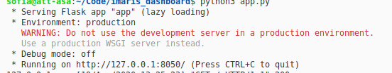
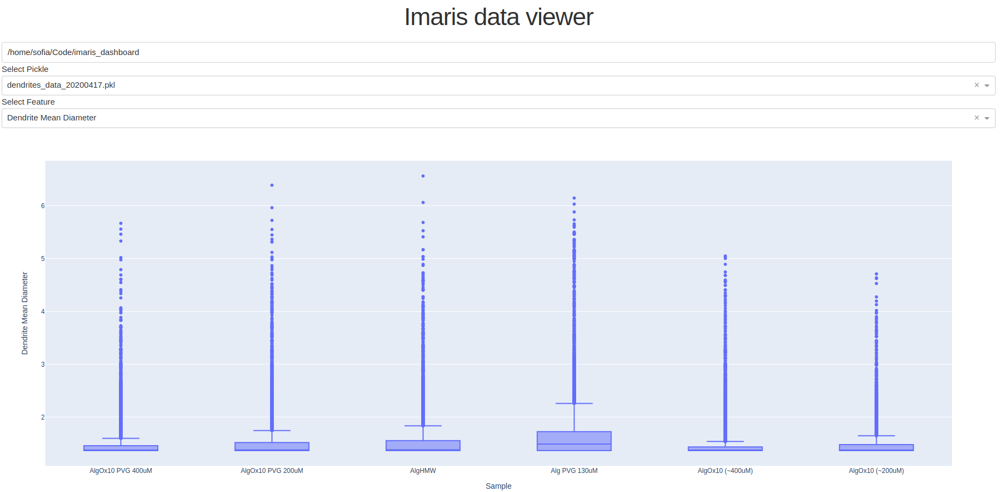

# imaris_dashboard

This launches a local web application which allows loading pickles and display a boxplot of those same pickles.

## Requirements

Open a terminal in the current directory and run

```
pip install -r requirements.txt
```

This will install the required packages for the app to run.

## Run the application 

In a terminal in the current directory run:
```
python3 app.py
```



Open the browser in the url shown (in this case, http://127.0.0.1:8050/)

You should get the following view.



You can set change the directory (to where the pickles are) in the top Input component. Automatically, both dropdown lists will be updated with the available pickles in that folder, as well as the features available in the pickle.

When you no longer need the visualization press CTRL+C in the terminal.


